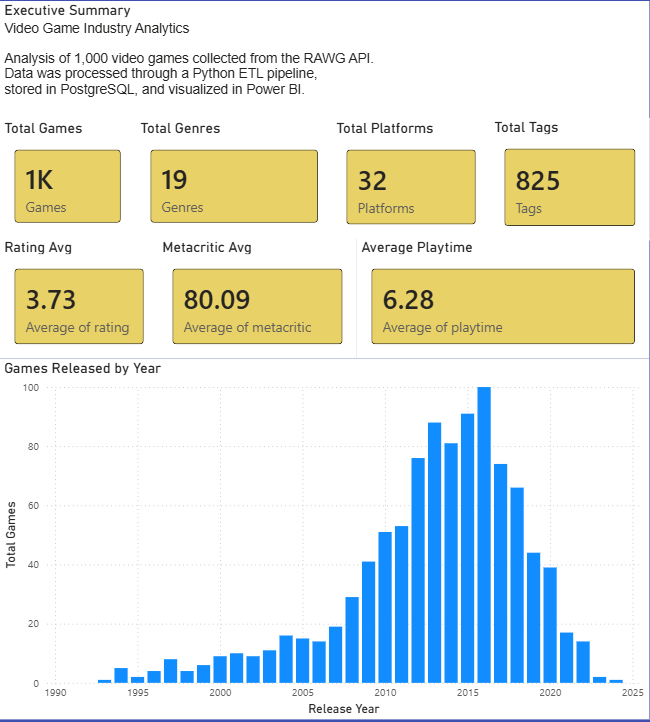
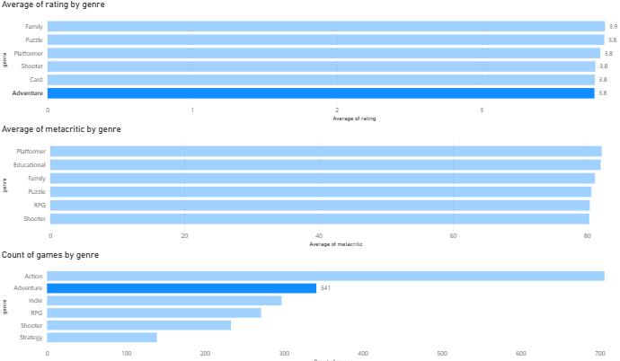
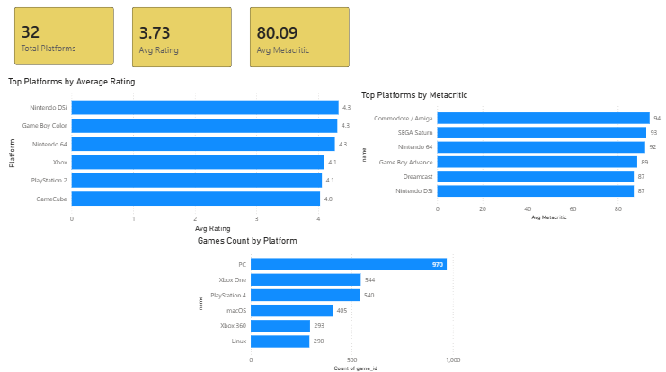

# 🎮 Game Industry Analytics Pipeline

A data engineering project that extracts video game data from the RAWG API, transforms and normalizes nested JSON structures, loads into PostgreSQL, and delivers business insights through SQL analytics and Power BI dashboards.

---

## 📌 Table of Contents

- [Overview](#overview)
- [Architecture](#architecture)
- [Tech Stack](#tech-stack)
- [Dashboard Preview](#dashboard-preview)
- [Data Model](#data-model)
- [ETL Process](#etl-process)
- [Dataset Statistics](#dataset-statistics)
- [Business Questions](#business-questions)
- [Skills Demonstrated](#skills-demonstrated)
- [Future Improvements](#future-improvements)

---

## Overview

This project simulates a real-world data engineering workflow — from raw API ingestion to interactive business intelligence.

**Pipeline steps:**

1. **Extract** — Fetch video game data from the RAWG API using paginated requests
2. **Transform** — Clean, validate, flatten nested JSON, and generate derived fields
3. **Normalize** — Model entities and relationships into a relational schema
4. **Load** — Persist data into PostgreSQL via SQLAlchemy with idempotent strategies
5. **Analyze** — Query with SQL and visualize in Power BI dashboards

---

## Architecture
RAWG API
↓
Python ETL Pipeline
↓
Data Transformation & Normalization
↓
PostgreSQL Data Warehouse
↓
SQL Analytics
↓
Power BI Dashboards

---

## Tech Stack

| Layer | Tools |
|---|---|
| Ingestion | Python, RAWG API |
| Storage | PostgreSQL, SQLAlchemy |
| Visualization | Power BI |
| Version Control | Git, GitHub |

---

## Dashboard Preview

### 📊 Executive Overview

High-level metrics including total games, average ratings, Metacritic scores, and release trends over time.

---

### 🎯 Genre & Platform Analysis

Explores relationships between genres, platforms, ratings, and review metrics to surface the most successful categories.

---

### 🏪 Market & Store Insights

Analyzes store distribution, tag popularity, and market factors that influence game performance and visibility.

---

## Data Model

**Core entity:** `Games`

**Dimension tables:** `Genres` · `Platforms` · `Stores` · `Tags`

**Junction tables:** `Game_Genres` · `Game_Platforms` · `Game_Stores` · `Game_Tags`

---

## ETL Process

### Extract
Paginated requests to the RAWG API collect raw game records across multiple endpoints.

### Transform
- Cleans and validates raw data
- Flattens nested JSON structures
- Extracts relevant attributes and derives new fields (e.g. release year)
- Removes duplicates and normalizes values
- Generates relational mapping tables for many-to-many relationships

### Load
Processed datasets are loaded into PostgreSQL using SQLAlchemy with idempotent strategies to support safe re-runs.

---

## Dataset Statistics

| Entity | Count |
|---|---|
| Games | 1,000 |
| Genres | 19 |
| Platforms | 32 |
| Stores | 10 |
| Tags | 825 |

| Relationship | Records |
|---|---|
| Game ↔ Genre | 2,511 |
| Game ↔ Platform | 4,352 |
| Game ↔ Store | 3,565 |
| Game ↔ Tag | 18,093 |

---

## Business Questions

- Which genres receive the highest average ratings?
- Which platforms host the best-rated games?
- Do longer games receive better reviews?
- Which tags are most common among highly rated games?
- How has game quality evolved over time?
- What is the relationship between Metacritic scores and user ratings?

---

## Skills Demonstrated

`REST API Integration` `ETL Pipeline Development` `Data Cleaning & Transformation`
`Relational Data Modeling` `Many-to-Many Relationships` `SQL Analytics`
`Database Design` `Data Visualization` `Power BI` `Business Intelligence`

---

## Future Improvements

- [ ] Incremental data loading
- [ ] Cloud deployment (Azure / GCP)
- [ ] Data orchestration with Airflow
- [ ] Containerization with Docker
- [ ] Automated testing
- [ ] CI/CD pipelines

---

## Author

**Alejandro Castañeda**  

